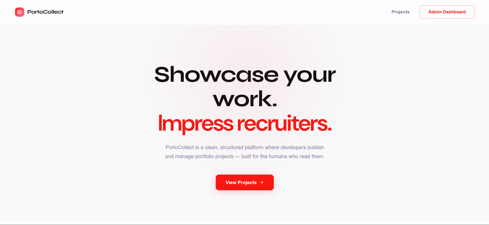

# 🚀 PortoCollect (Monorepo)

This project is a full-stack portfolio management system built with:

- **Frontend:** React + TypeScript + Vite + TailwindCSS
- **Backend:** Laravel (REST API)
- **Architecture:** Monorepo (frontend & backend in same repository)

It allows an admin to:

- Create projects
- Edit projects
- Manage categories
- Publish/unpublish projects
- Display projects publicly

---

## 🏗 Project Structure

```
root/
│
├── frontend/      # React application
├── portfolio-api/       # Laravel API
└── README.md
```

---

## ⚛️ Frontend (React)

### Tech Stack

- React
- TypeScript
- Vite
- TailwindCSS
- Formik + Yup (form validation)
- Axios (API communication)
- React Router

### 📦 Frontend Setup

**1️⃣ Navigate to frontend**

```bash
cd frontend
```

**2️⃣ Install dependencies**

```bash
npm install
```

**3️⃣ Run development server**

```bash
npm run dev
```

The app will start on:

```
http://localhost:5173
```

### 🔗 Frontend Environment

Make sure your Axios base URL points to your Laravel backend:

```js
baseURL: "http://127.0.0.1:8000/api";
```

---

## 🐘 Backend (Laravel)

### Tech Stack

- Laravel
- MySQL
- RESTful API
- Eloquent ORM

### 📦 Backend Setup

**1️⃣ Navigate to backend**

```bash
cd portfolio-api
```

**2️⃣ Install dependencies**

```bash
composer install
```

**3️⃣ Setup environment file**

In `env.example`

> Update database credentials inside `.env`.

**4️⃣ Generate application key**

```bash
php artisan key:generate
```

**5️⃣ Run migrations**

```bash
php artisan migrate
```

**6️⃣ Start development server**

```bash
php artisan serve
```

The API will run on:

```
http://127.0.0.1:8000
```

---

## 🔄 Development Workflow (Monorepo)

Open two terminals:

**Terminal 1 – Backend**

```bash
cd backend
php artisan serve
```

**Terminal 2 – Frontend**

```bash
cd frontend
npm run dev
```

---

## 🌍 Deployment Notes

**Build frontend:**

```bash
npm run build
```

- Deploy Laravel backend to server
- Serve React build via static hosting
